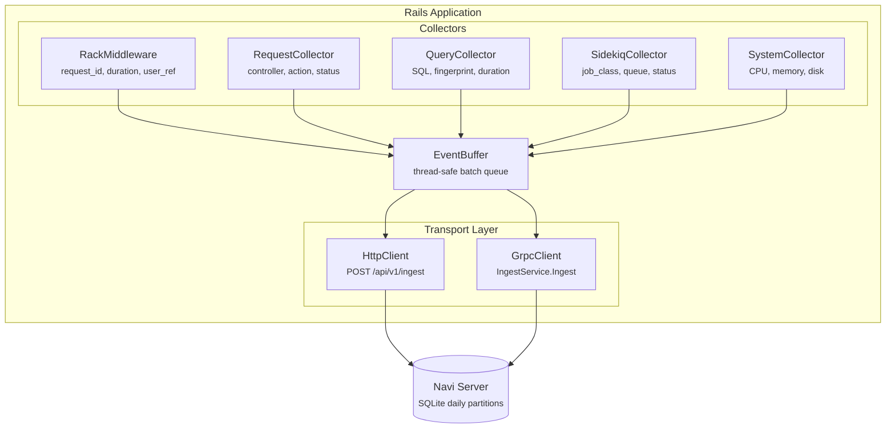

# Navi Ruby

Lightweight APM client for Rails applications. Streams telemetry data to a [Navi](https://github.com/nanocohub/navi) server via HTTP or gRPC.

## Architecture



## Features

- **Zero-overhead collection**: Hooks into Rails instrumentation (no monkey-patching)
- **Thread-safe buffering**: Events are batched and flushed asynchronously
- **Dual transport**: HTTP REST or gRPC (configurable)
- **Sidekiq support**: Optional job monitoring when Sidekiq is present
- **System metrics**: CPU, memory, and disk utilization sampling

## Installation

Add to your Gemfile:

```ruby
gem 'navi-ruby', git: 'https://github.com/nanocohub/navi-ruby.git'
```

Run:

```bash
bundle install
```

## Configuration

Create `config/initializers/navi_ruby.rb`:

```ruby
NaviRuby.configure do |config|
  # Required: Server connection
  config.server_url = 'https://navi.example.com'  # for HTTP transport
  # config.grpc_url = 'navi.example.com:50051'    # for gRPC transport
  # config.transport = :grpc                       # default: :http
  config.api_key = ENV['NAVI_API_KEY']

  # Optional: Application name (defaults to Rails app name)
  config.app_name = 'MyApp'

  # Optional: Filtering
  config.ignored_paths = ['/health', '/assets', '/favicon.ico']
  config.ignored_endpoints = ['HealthController#index']
  config.ignored_sql_patterns = [/^SHOW/]

  # Optional: Query sampling (reduce volume in high-traffic apps)
  config.min_query_duration_ms = 10   # ignore fast queries
  config.query_sample_rate = 0.5      # sample 50% of queries

  # Optional: Buffer tuning
  config.buffer_size = 500            # flush when buffer reaches this size
  config.flush_interval = 10          # flush every N seconds

  # Optional: System metrics
  config.system_sample_interval = 60  # sample system metrics every N seconds

  # Optional: Custom data extraction
  config.custom_data_proc = proc { |env|
    { tenant_id: env['warden']&.user&.tenant_id }
  }

  # Debugging
  config.debug = false
end
```

## Server Compatibility

Navi Ruby sends telemetry to a Navi server using either HTTP or gRPC:

Canonical contract reference: `navi/docs/reference/ingest-api-contract.md`

- HTTP endpoint: `POST /api/v1/ingest`; gRPC service: `navi.IngestService` (`Ingest`, `StreamIngest`)
- `config.api_key` maps to `Authorization: Bearer <api_key>`
- `config.app_name` maps to `X-Project-Name` (HTTP) and `x-project-name` (gRPC metadata)
- Expected behavior: accepted ingest (`202`), auth failures (`401` / `UNAUTHENTICATED`), overload protection (`503` / `RESOURCE_EXHAUSTED`)

## Production Endpoint Examples (Lightsail)

For HTTPS ingest behind Nginx:

```ruby
config.transport = :http
config.server_url = 'https://navi.example.com'
```

For direct gRPC ingest (only expose when needed):

```ruby
config.transport = :grpc
config.grpc_url = 'navi.example.com:50051'
```

Use an API key created in Navi and make sure `config.app_name` exactly matches the Navi project name.

## Collectors

| Collector | Description | ActiveSupport Event |
|-----------|-------------|---------------------|
| `RackMiddleware` | Wraps requests, assigns `request_id`, measures duration | N/A (Rack) |
| `RequestCollector` | Controller/action, status, db/view runtimes | `process_action.action_controller` |
| `QueryCollector` | SQL, fingerprint, duration, source location | `sql.active_record` |
| `SidekiqCollector` | Job class, queue, duration, status | Sidekiq middleware |
| `SystemCollector` | CPU, memory, disk usage | Timer-based sampling |

## Event Types

Events sent to the server include:

- **request** — HTTP request with timing and user info
- **request_metadata** — Controller/action details merged with request
- **query** — Individual SQL query with fingerprint
- **background_job** — Sidekiq job execution
- **system_metric** — Server resource utilization

## Transport Options

### HTTP (default)

```ruby
config.transport = :http
config.server_url = 'https://navi.example.com'
```

Events are POSTed to `/api/v1/ingest` as JSON.

### gRPC

```ruby
config.transport = :grpc
config.grpc_url = 'navi.example.com:50051'
```

Uses protocol buffers for efficient serialization. Requires `grpc` and `google-protobuf` gems (included as dependencies).

## Related Docs

- Navi server README: https://github.com/nanocohub/navi
- Navi deployment model (Terraform + Ansible + ECR + GitHub Actions): https://github.com/nanocohub/navi/tree/main/infra
- Navi ingest API contract: https://github.com/nanocohub/navi/blob/main/docs/reference/ingest-api-contract.md

## Dependencies

Required:
- `concurrent-ruby` >= 1.0
- `railties` >= 6.1

System metrics (included):
- `sys-cpu`
- `sys-filesystem`
- `get_process_mem`

gRPC transport:
- `grpc` >= 1.50
- `google-protobuf` >= 3.21

## License

MIT
